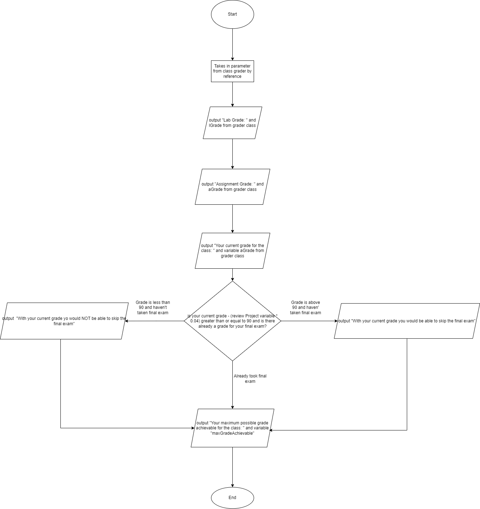
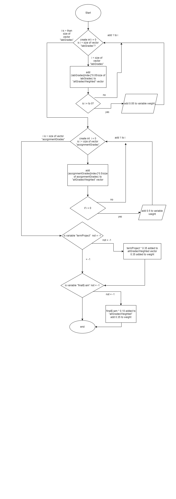
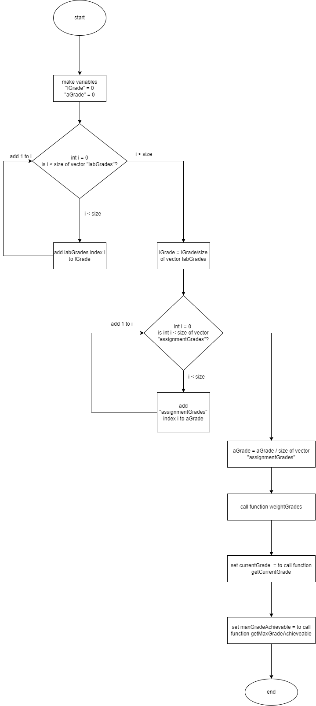

# csc212-review-project
Review Project for CSC212

Group Members: Phakeo Arounerangsy, Henry Gutierrez, Timothy Hourihan, Jagger Pacheco

# Summary of Program + Group Member Contributions
## Summary of Program
Our program does abc because xyz...

## Group Member Contributions
- Phakeo - Created flowcharts and videos demonstrating how program runs. Helped with program pseudocode. 
- Henry - Implemented code for main.cpp. 
- Tim - Created skeleton for main.cpp, Grader.cpp, Grader.h. Implemented code for Grader.cpp. Helped with readme.md
- Jagger - Implemented code for Grader.cpp. Helped with readme.md. 

# Proof of Planning: Pseudocode
## Main function Skeleton
```

#include "Grader.h"

void getInput(Grader &grader);
void printResults(Grader &grader);

int main() {
    // Create instance of class "Grader"
    Grader grader;

    // Get input
    getInput(grader);

    // Perform operations on input data
    grader.startGrading();

    // Print results
    printResults(grader);
}

// Get input grades from user
void getInput(Grader &grader){
    // Walk user through how to enter their grades for each category

    // For each category in the Grader class instance:
        // Prompt user how many grades they have
        // For each grade the user has to enter:
            // Add grade to its category vector in the Grader class instance
}

void printResults(Grader &grader){
    // Display each property from the grader class to the user

    // Display the student's current grade
        // Show a breakdown of the student's grade by each assignment

    // Show the maximum possible grade achievable if the student earns a 100 on everything in the future
}
```

## Header File

```
#ifndef CSC212_REVIEW_PROJECT_GRADER_H
#define CSC212_REVIEW_PROJECT_GRADER_H
#include <bits/stdc++.h>
using namespace std;

class Grader {
    public:
        vector<double> labGrades;
        vector<double> assignmentGrades;
        double termProject;
        double finalExam;
        double reviewProject;
        double lGrade;
        double aGrade;
        double weight;
        vector<double> allGradesWeighted;

        double currentGrade;
        double maxGradeAchievable;

        void startGrading();
        double getCurrentGrade();
        void weightGrades();
        double getMaxGradeAchievable();

};


#endif
```
## Grader Class
```
#include "Grader.h"

double Grader::getCurrentGrade() {
    // add each weighted grade to the total grade vector
    // create total grade
    // add review project points
        
    // return currentGrade
}


void Grader::weightGrades() {
    
    //Goes through each grade category and adds the weighted value of each individual assignment, excluding review project grade
        //adds cumulative weight if a category has an entry
}

double Grader::getMaxGradeAchievable() {
    // Check if current size of allGrades is as big as it can be
    // If it is not, then add 100s for each grade
    
    // Recalculate weights with new values included
    weightGrades();
    
    // Calculate grade with added 100s
    // return getCurrentGrade();
}

void Grader::startGrading() {
    
    // Set all weighted grades
    weightGrades();
    
    // Get current grade
    currentGrade = getCurrentGrade(this->allGrades);
    
    // Get max grade achievable
    maxGradeAchievable = getMaxGradeAchievable(this->allGrades);
}
```

# Proof of Planning: Flowcharts
## Main function flow chart 
.png)
### Get Input function flow chart
.png)
### Print Results flow chart

## Grader class flow chart
### getCurrentGrade function flow chart

### weightGrades function flow chart

### getMaxAchievable function flow chart

### startGrading function flow chart

# Algorithm explained: Input/Output and Reasoning
Input used std::cin and was guided by std::cout prompts

Output used std::cout

This input/output structure allowed for a highly dynamic approach that anticipated quick and intuitive data collection for a wide array of students. Output was straightforward and efficient

This specific style of development was important to our group, because calculating a grade is in truth a very simple mathematical operation. We wanted it to be presented in a simple manner. No student should have to create a text file just to calculate their grade.

Another goal we strived for was to provide any useful information a student might want without overwhelming them with inputs and outputs to ensure are program was as helpful as possible.

## Input: 
for each of the five grade categories, the first prompt would be the number of grades the user wishes to enter. They would thereafter be prompted to input that many grades. This repeats five times. For grade categories that contain only one assignment (Term Project, Final Exam, and Review Project), a number greater than 1 will prompt only once.

## Output:
1. Average Lab Grade
2. Average Assignment Grade
3. Current Grade
4. Whether user can skip final exam with current grade (Current grade includes review project, so the review project grade is subtracted from the current grade for the calculation)
5. Maximum Achievable Grade

## Mock Datasets
Input one of these lines upon first std::cin prompt:

    4 100 100 100 100 3 100 100 90 1 85 0 1 75
    
    10 100 100 100 100 100 100 100 100 100 100 5 90 100 87 100 90 1 90 1 82 1 100
    
    2 0 100 2 30 0 0 0 1 100
    
    6 100 100 0 0 100 100 3 50 50 60 1 90 0 0

## Instructions for Input && Compiling Program

Compile program with command:

    g++ main.cpp Grader.cpp -o prog && ./prog

Input according to prompts. For each of the five categories, input the number of grades for that category, then input each grade. This can be done sequentially or all in a single line.

## Video
[](http://www.youtube.com/watch?v=44yi8XSHxrU "Csc 212 Review Project Code Analysis")
